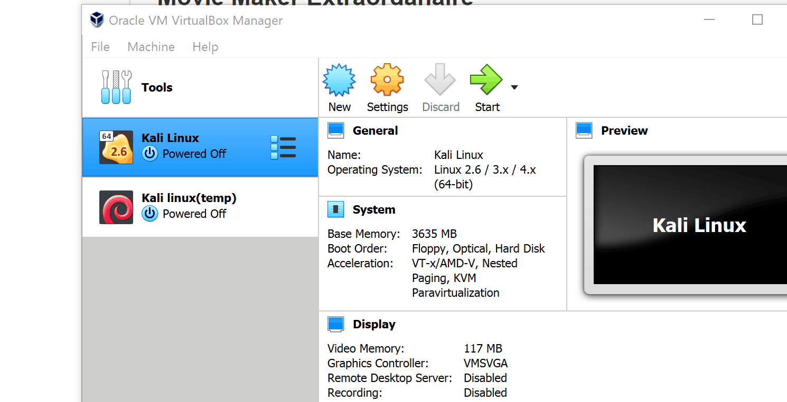
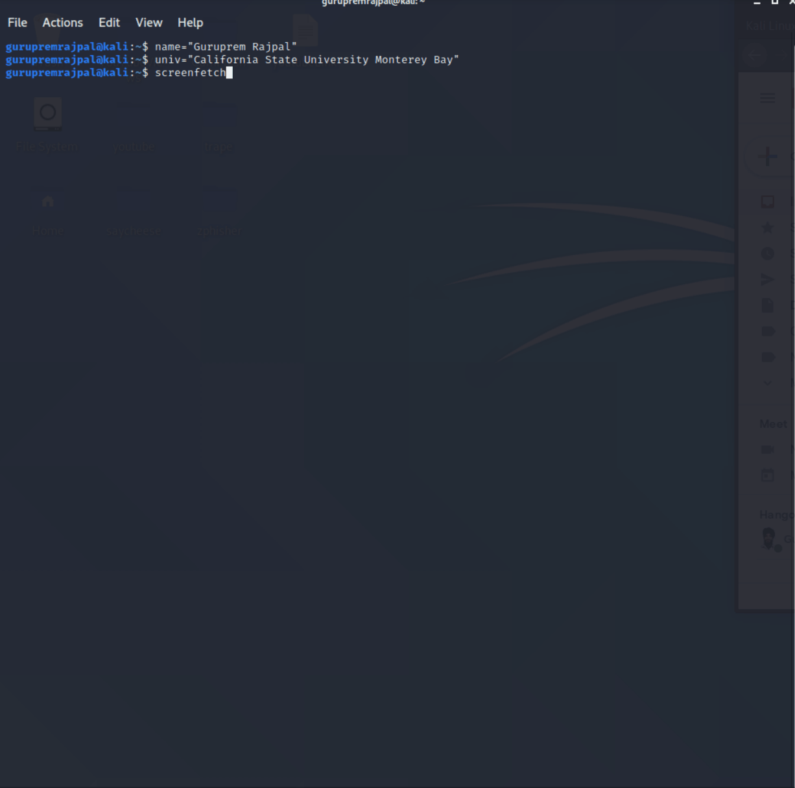

# VirtualBox and Kali

**Homework Instructions**: 

1. Create a GIF recording of you starting your new Kali VM. Show VirtualBox Manger, click Start on your Kali box and end the recording when it reaches the login prompt. If it's larger than 5 MB, try to remove any large swathes of redudant frames. Save it as `vbox_kali.gif`.
2. Create a GIF recording of you running the following command block in your Kali Terminal. Copy it to a text editor first and **replace the first 2 variables, name and univ, with your real name and college name**, then copy/paste the code block into a Terminal. 

```
name="FirstName LastName"
univ="University of Science"

screenfetch
echo $name'@'$univ
```

Save the file as **screenfetch.gif**.

**Challenges and Problems**: 

### Installing VirtualBox and Kali

 
### Running screenfetch


## License

    Copyright [2020] [Guruprem Rajpal]

    Licensed under the Apache License, Version 2.0 (the "License");
    you may not use this file except in compliance with the License.
    You may obtain a copy of the License at

        http://www.apache.org/licenses/LICENSE-2.0

    Unless required by applicable law or agreed to in writing, software
    distributed under the License is distributed on an "AS IS" BASIS,
    WITHOUT WARRANTIES OR CONDITIONS OF ANY KIND, either express or implied.
    See the License for the specific language governing permissions and
    limitations under the License.
